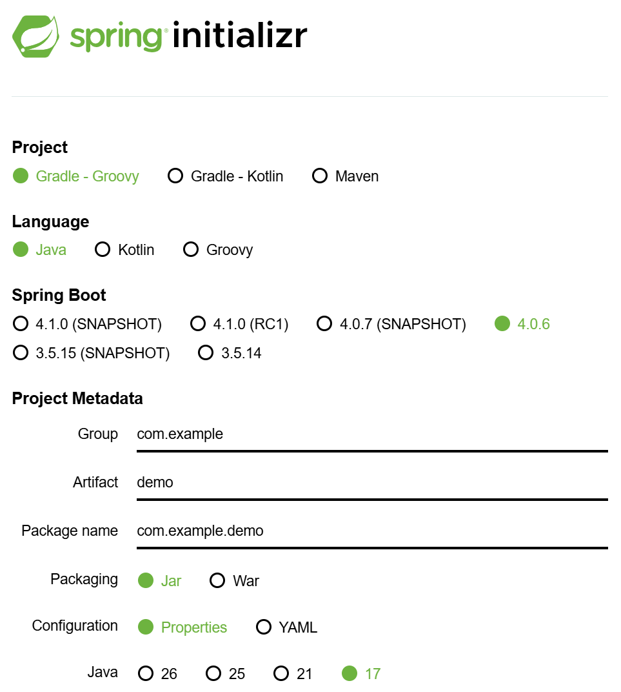

# week4

### 스프링 부트 프로젝트 생성

- http**s**://start.spring.io/
    - s는 secure 약자
    - 보안을 강력하게 함
- https://start.spring.io/ 사이트 접속
    
    
    
    - Project = 빌드 도구
        1. 엔트
        2. 메이븐
        3. 그레이들 (가장 최신)
    - Metedata = 프로젝트 밖에서 바라보자
    - Packaging = 프로젝트 마무리 후 압축할 형태
        - Jar 자르 → 자바 아카이브
        - War 와르 → 웹 아카이브
    - Java 8, 11, 17 버전을 실무에서 사용함
    - **dependency** = 의존성 = 사용한다
    
    
    
    - Spring Web 선택 → generate

### 프로젝트 구조 뜯어보기


- `.gradle` : Gradle이 사용하는 폴더
    - Gragle의 캐시 파일 들어있음
    - 캐시 : 임시로 저장하는 용도
- `build` : 실행할 준비를 마치면 생성되는 폴더
- `src` : 메인과 테스트 폴더 존재
    
    
    
    - 메인 밑에 **자바**와 리소스 폴더 존재
    - `DemoApplication` 클래스 존재
        
        자바 프로젝트는 메인 메소드로 실행 시킴 → 이 프로그램 실행
        
        ```java
        public class DemoApplication {
        
        	public static void main(String[] args) {
        		SpringApplication.run(DemoApplication.class, args);
        	}
        
        }
        ```
        
    - `resources` : 소스 파일 아닌 것 모음
- `test` : Test Driven Development (TDD)
- `build.gradle` : 그레이들이 빌드할 때 사용하는 문서
    
    ```groovy
    dependencies {
    	implementation 'org.springframework.boot:spring-boot-starter-webmvc'
    	testImplementation 'org.springframework.boot:spring-boot-starter-webmvc-test'
    	testRuntimeOnly 'org.junit.platform:junit-platform-launcher'
    }
    ```
    
- `settings.gradle` : 프로젝트 관련해서 설정할 것

### 실행하기

- 스프링이 실행하려면 메인 메소드를 찾아야 함 → 실행
    
    
    

### 스프링 주요 원리 ⭐⭐⭐

- 자바라서 불편한 점
    - 객체 지향 언어 → 객체(메소드 호출, 로직 짜는…) 필요
- **IoC**
    - Inversion of Control 제어의 역전
        
        프로그램의 흐름을 제어하는 추제가 정반대로 바뀌었다
        
    - Inversion : 정반대로 뒤집힌다.
    - Control : 제어 → 프로그램의 흐름 = 객체의 흐름
    - 즉, 객체의 제어권을 정반대로 뒤집는다.
        - 개발자 → 스프링
- **컨테이너**
    - 스프링이 객체를 생성해서 관리를 해야 함
    - 객체를 관리하기 위한 박스 = 스프팅/IoC/DI 컨테이너
- **스프링 빈**
    - 스프링이 컨테이너에 담아두고 관리하는 객체
- **DI**
    - Dependency Injection 의존성 주입
        
        개발자가 객체를 주입 받는다
        
    - 의존한다 = 사용한다 → 의존성 = 사용하는 것 = **객체**
        - 개발자 입장 : 주입 받는다
        - 스프링 입장 : 주입 한다
- 객체를 사용한다? 객체를 생성해서 메소드/필드 호출 및 접근한다!
- IoC를 구현하기 위해 DI가 필요하다