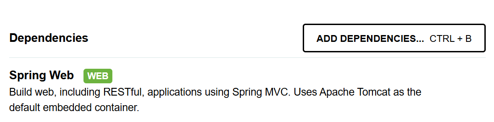

# week5

### 프로젝트

- 상품 조회, 등록 API 프로젝트 진행할 것
- **Spring Web**이라는 Dependency 사용한다면 가능한 것
    
    
    
    - **Build web** = 웹 만들기
    - **including RESTful** = REST API 만들 수 있도록 틀 제공
    - **applications using Spring MVC** = Spring MVC 활용해서 어플리케이션 제작

### Spring MVC

- 클래스 구조 = 역할 부여
    - **View** : 화면 → Spring에서 만들 수 있지만 프론트에서 진행
    - **Controller** : View(사용자)와 Model 중간 매개체
    - **Model** : 데이터 연산(DB 소통, 로직), 로직
        - 상세 역할 분리 → DB 소통 : **Repository** / 로직 : **Service**
        - 역할 분리 시 유지 보수 good
- View ↔ Controller ↔ Model

### Controller

- Controller 역할을 하는 클래스 만들어보자!
- `com.example.demo` 아래에 `ProductController` 클래스 만들기
    - 컨트롤러 중에서도 상품 조회와 상품 등록을 담당한다는 의미
    
    
    

### Annotation

- 스프링에게 ‘이거 객체로 잘 부탁한다’고 말해야 함
- **오버라이드**된 코드 예시
    
    ```java
    package com.example.demo;
    
    public class AnnotationDemo {
    }
    
    class Parent {
        public void method() {
            System.out.println("parent");
        }
    }
    
    class Child  extends Parent {
        public void method() {
            System.out.println("child");
        }
    }
    ```
    
    ```java
    class Child  extends Parent {
    		// h 제거하고 오버라이드 추가하면 잘못을 알려줌
        @Override
        public void metod() {
            System.out.println("child");
        }
    }
    ```
    
- 어노테이션의 역할 = 아래 3가지에게 **알려주기**
    1. compiler 컴파일러 → ex. `@override`
    2. 빌드 도구 → ex. `@Getter`
    3. 프레임워크 → ex. `@스프링, 아래 클래스를 스프링빈(객체)으로 관리해줘`